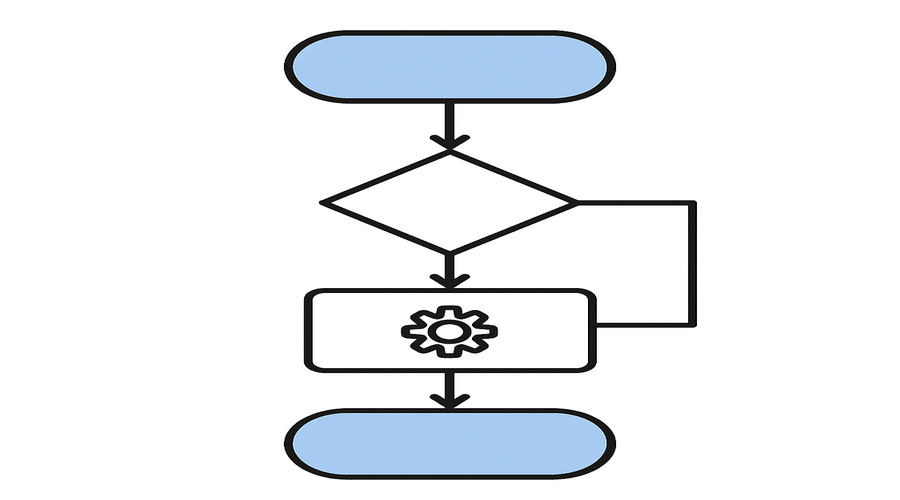

# Grade 10 - Week 28: Web Programming
## Learning Objectives
- Explain Web Programming in clear, age-appropriate language.
- Identify the key parts or steps of Web Programming.
- Apply Web Programming to a real-life or classroom example.
- Demonstrate: Align Elements with CSS (Part 1).
- Demonstrate: Align Elements with CSS (Part 2).

## Assessment Criteria
- Uses correct terminology when explaining Web Programming.
- Completes the practice activity accurately.
- Responds to oral questions with clear reasoning.
- Shows understanding of: Align Elements with CSS (Part 1), Align Elements with CSS (P.

## Key Vocabulary
- web: a key term related to Web Programming
- programming: a key term related to Web Programming
- align: a key term related to Web Programming
- elements: a key term related to Web Programming
- css: a key term related to Web Programming
- part: a key term related to Web Programming
- input: data entered into a system
- output: results produced by a system
- process: steps that transform input to output
- system: connected parts working together

## Lesson Timeline
- Introduction - 5 minutes
- Main Activity - 25 minutes
- Wrap-up - 10 minutes

## Introduction (5 minutes)
- Introduce Web Programming and link it to everyday technology.
- Warm-up questions:
- - Where do we encounter this idea in daily life?
- - How does this help computers work correctly?
- Real-life examples:
- - A classroom example connected to Web Programming.
- - Link to: Align Elements with CSS (Part 1), Align Elements with CSS (Part 2).
- Teacher: Briefly model the key idea using a quick sketch or object.
- Students: Share one example they know and explain why it fits.

## Main Content (25 minutes)
- Define Web Programming in clear terms.
- Break down the key components or steps.
- Show a short, concrete example.
- Connect to prior knowledge from earlier lessons.
- Focus point: Align Elements with CSS (Part 1).
- Focus point: Align Elements with CSS (Part 2).
- Discuss a practical application or case study.
- Teacher: Model the process step-by-step and check for understanding.
- Students: Take brief notes and answer a quick concept check.

## Practice Activity
- Short response: Describe a scenario where Web Programming is important.
- Matching: Pair terms with their definitions.
- Teacher: Circulate, prompt with guiding questions, and correct misconceptions.
- Students: Work in pairs and compare answers.
- Apply: Align Elements with CSS (Part 1).
- Apply: Align Elements with CSS (Part 2).

## Assessment
- Observation during activity.
- Oral Q&A: Students explain one part of Web Programming.
- Quick written check: 3 short questions.
- Mini rubric: 3 = accurate and complete, 2 = mostly correct, 1 = needs support

## Homework
- Write a short paragraph about Web Programming using at least 4 vocabulary terms.

## Teacher Reflection
- Which part of Web Programming was easiest for students to understand?
- Which activity best supported learning objectives?
- What should be adjusted for next time?
