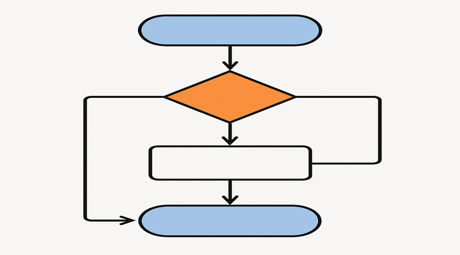

# Grade 10 - Week 34: Web Programming, Quiz
## Learning Objectives
- Explain Web Programming, Quiz in clear, age-appropriate language.
- Identify the key parts or steps of Web Programming, Quiz.
- Apply Web Programming, Quiz to a real-life or classroom example.
- Demonstrate: Javascript Loop.
- Analyze how Web Programming, Quiz affects system design or problem solving.

## Assessment Criteria
- Uses correct terminology when explaining Web Programming, Quiz.
- Completes the practice activity accurately.
- Responds to oral questions with clear reasoning.
- Shows understanding of: Javascript Loop.

## Key Vocabulary
- web: a key term related to Web Programming, Quiz
- programming: a key term related to Web Programming, Quiz
- quiz: a key term related to Web Programming, Quiz
- javascript: a key term related to Web Programming, Quiz
- loop: a key term related to Web Programming, Quiz
- input: data entered into a system
- output: results produced by a system
- process: steps that transform input to output
- system: connected parts working together
- accuracy: being correct or free of errors

## Lesson Timeline
- Introduction - 5 minutes
- Main Activity - 25 minutes
- Wrap-up - 10 minutes

## Introduction (5 minutes)
- Introduce Web Programming, Quiz and link it to everyday technology.
- Warm-up questions:
- - Where do we encounter this idea in daily life?
- - How does this help computers work correctly?
- Real-life examples:
- - A classroom example connected to Web Programming, Quiz.
- - Link to: Javascript Loop.
- Teacher: Briefly model the key idea using a quick sketch or object.
- Students: Share one example they know and explain why it fits.

## Main Content (25 minutes)
- Define Web Programming, Quiz in clear terms.
- Break down the key components or steps.
- Show a short, concrete example.
- Connect to prior knowledge from earlier lessons.
- Focus point: Javascript Loop.
- Discuss a practical application or case study.
- Teacher: Model the process step-by-step and check for understanding.
- Students: Take brief notes and answer a quick concept check.

## Practice Activity
- Short response: Describe a scenario where Web Programming, Quiz is important.
- Matching: Pair terms with their definitions.
- Teacher: Circulate, prompt with guiding questions, and correct misconceptions.
- Students: Work in pairs and compare answers.
- Apply: Javascript Loop.

## Assessment
- Observation during activity.
- Oral Q&A: Students explain one part of Web Programming, Quiz.
- Quick written check: 3 short questions.
- Mini rubric: 3 = accurate and complete, 2 = mostly correct, 1 = needs support

## Homework
- Write a short paragraph about Web Programming, Quiz using at least 4 vocabulary terms.

## Teacher Reflection
- Which part of Web Programming, Quiz was easiest for students to understand?
- Which activity best supported learning objectives?
- What should be adjusted for next time?
