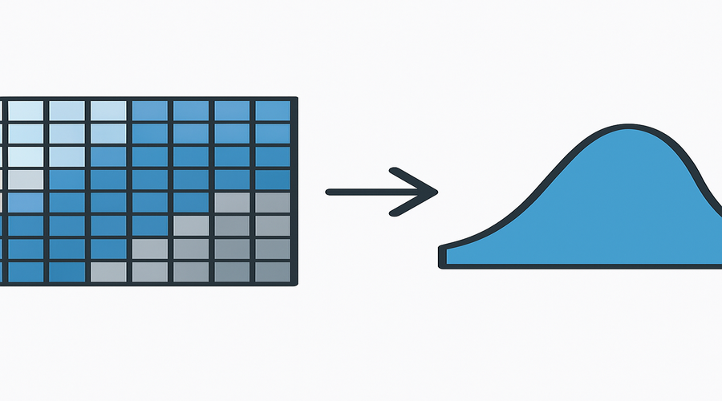

# Grade 5 - Week 11: Bitmap image processing
## Learning Objectives
- Explain Bitmap image processing in clear, age-appropriate language.
- Identify the key parts or steps of Bitmap image processing.
- Apply Bitmap image processing to a real-life or classroom example.
- Demonstrate: Create and edit bitmap images.
- Use Bitmap image processing vocabulary accurately in short explanations.

## Assessment Criteria
- Uses correct terminology when explaining Bitmap image processing.
- Completes the practice activity accurately.
- Responds to oral questions with clear reasoning.
- Shows understanding of: create and edit bitmap images.

## Key Vocabulary
- bitmap: a key term related to Bitmap image processing
- image: a key term related to Bitmap image processing
- processing: a key term related to Bitmap image processing
- create: a key term related to Bitmap image processing
- edit: a key term related to Bitmap image processing
- bitmap: a key term related to Bitmap image processing
- input: data entered into a system
- output: results produced by a system
- process: steps that transform input to output
- system: connected parts working together

## Lesson Timeline
- Introduction - 5 minutes
- Main Activity - 25 minutes
- Wrap-up - 10 minutes

## Introduction (5 minutes)
- Introduce Bitmap image processing and link it to everyday technology.
- Warm-up questions:
- - Where do we encounter this idea in daily life?
- - How does this help computers work correctly?
- Real-life examples:
- - A classroom example connected to Bitmap image processing.
- - Link to: create and edit bitmap images.
- Teacher: Briefly model the key idea using a quick sketch or object.
- Students: Share one example they know and explain why it fits.

## Main Content (25 minutes)
- Define Bitmap image processing in clear terms.
- Break down the key components or steps.
- Show a short, concrete example.
- Connect to prior knowledge from earlier lessons.
- Focus point: Create and edit bitmap images.
- Teacher: Model the process step-by-step and check for understanding.
- Students: Take brief notes and answer a quick concept check.

## Practice Activity
- Classification: Sort examples into 'related to Bitmap image processing' and 'not related'.
- Short response: Write two sentences using key vocabulary.
- Teacher: Provide concrete examples and model one classification.
- Students: Share answers with a partner.
- Practice: Create and edit bitmap images.

## Assessment
- Observation during activity.
- Oral Q&A: Students explain one part of Bitmap image processing.
- Quick written check: 3 short questions.
- Mini rubric: 3 = accurate and complete, 2 = mostly correct, 1 = needs support

## Homework
- Write a short paragraph about Bitmap image processing using at least 4 vocabulary terms.

## Teacher Reflection
- Which part of Bitmap image processing was easiest for students to understand?
- Which activity best supported learning objectives?
- What should be adjusted for next time?
