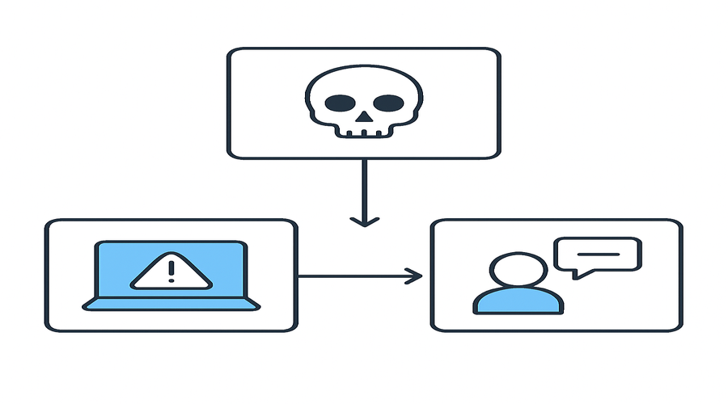

# Grade 5 - Week 29: Dangers of working on the Internet
## Learning Objectives
- Explain Dangers of working on the Internet in clear, age-appropriate language.
- Identify the key parts or steps of Dangers of working on the Internet.
- Apply Dangers of working on the Internet to a real-life or classroom example.
- Demonstrate: To talk about the illegality of copying someone else's work.
- Use Dangers of working on the Internet vocabulary accurately in short explanations.

## Assessment Criteria
- Uses correct terminology when explaining Dangers of working on the Internet.
- Completes the practice activity accurately.
- Responds to oral questions with clear reasoning.
- Shows understanding of: to talk about the illegality of copying someone else's work.

## Key Vocabulary
- dangers: a key term related to Dangers of working on the Internet
- working: a key term related to Dangers of working on the Internet
- internet: a key term related to Dangers of working on the Internet
- talk: a key term related to Dangers of working on the Internet
- about: a key term related to Dangers of working on the Internet
- illegality: a key term related to Dangers of working on the Internet
- input: data entered into a system
- output: results produced by a system
- process: steps that transform input to output
- system: connected parts working together

## Lesson Timeline
- Introduction - 5 minutes
- Main Activity - 25 minutes
- Wrap-up - 10 minutes

## Introduction (5 minutes)
- Introduce Dangers of working on the Internet and link it to everyday technology.
- Warm-up questions:
- - Where do we encounter this idea in daily life?
- - How does this help computers work correctly?
- Real-life examples:
- - A classroom example connected to Dangers of working on the Internet.
- - Link to: to talk about the illegality of copying someone else's work.
- Teacher: Briefly model the key idea using a quick sketch or object.
- Students: Share one example they know and explain why it fits.

## Main Content (25 minutes)
- Define Dangers of working on the Internet in clear terms.
- Break down the key components or steps.
- Show a short, concrete example.
- Connect to prior knowledge from earlier lessons.
- Focus point: To talk about the illegality of copying someone else's work.
- Teacher: Model the process step-by-step and check for understanding.
- Students: Take brief notes and answer a quick concept check.

## Practice Activity
- Classification: Sort examples into 'related to Dangers of working on the Internet' and 'not related'.
- Short response: Write two sentences using key vocabulary.
- Teacher: Provide concrete examples and model one classification.
- Students: Share answers with a partner.
- Practice: To talk about the illegality of copying someone else's work.

## Assessment
- Observation during activity.
- Oral Q&A: Students explain one part of Dangers of working on the Internet.
- Quick written check: 3 short questions.
- Mini rubric: 3 = accurate and complete, 2 = mostly correct, 1 = needs support

## Homework
- Write a short paragraph about Dangers of working on the Internet using at least 4 vocabulary terms.

## Teacher Reflection
- Which part of Dangers of working on the Internet was easiest for students to understand?
- Which activity best supported learning objectives?
- What should be adjusted for next time?
